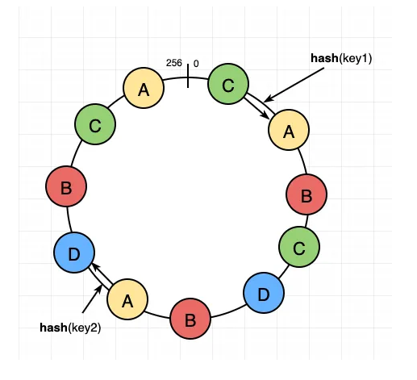

## Database Fundamentals

### Table of Contents
- [Database Fundamentals](#database-fundamentals)
  - [Table of Contents](#table-of-contents)
  - [Difference between SQL vs NoSQL](#difference-between-sql-vs-nosql)
  - [What is database replication?](#what-is-database-replication)
  - [Database Sharding and Partioning](#database-sharding-and-partioning)
  - [Consistent Hashing](#consistent-hashing)

### Difference between SQL vs NoSQL

SQL databases are Relational Databases (RDBMS) whereas NoSQL databases are Non Relational Databases (NonRDBMS). Following are the differences between them:
- **Relations**: When we have to have relations between the data objects like parent-child or linked data like two interdepndent data objects. It easier to implements these logics in SQL compared to NoSQL.
- **SCHEMA**: SQL databases use structured query language (SQL) and have a predefined schema. NoSQL databases have dynamic schemas for unstructured data.
- **Data Storage**: In SQl, We store data in terms of tables and rows to read and write. NoSQL, We store data in terms of Documents, key-value, graph, or wide-column to read and write.
- **Scalibility**: SQL databases are mostly vertically scalable and hard to scale hosizontally, while NoSQL databases are easily horizontally scalable.
- **Transactional**: SQL databases are better for multi-row transactions, while NoSQL is better for unstructured data like documents or JSON. 
- **ACID Property** Follows ACID properties (Atomicity, Consistency, Isolation, Durability) for transaction management. e.g., Banking App.
- **Joins**: SQL supports Joins for complex queries. NoSQL doesn't support it.
- **Examples**: SQL (MySQL, PostgreSQL, Oracle). NoSQL (MongoDB, Cassandra, Couchbase, Amazon DynamoDB, Redis)

### What is database replication?

When we create more than one copy of database and they are in sync, Its called db replication. There is `master` and `read` replicas.
There are many benefits of doing that:
- **DB Failures**: Database replication is used to handle db failure by making one of the read replica as master when a master db goes down.
- **Disaster Recovery**: disaster recovery is achieved by creating the read replicas in different regions so that we dont loose data when a region goes down.
- **Performance Optimizations**: Reads can be happening from read replicas near to user location and writes happens in master db to optimize read and writes performance.
- **Drawback:Consistency**: We loose strong consistency and our system become eventual consistent when we read from replicas due to the fact that if we read before sync of updated data may get old data. For some application it's okay but for some it's not acceptable. Based on usecase we must decide on what solution to try.
There are different solutions people try to solve this issue:
    - **Only Write**: The write happens and sends the response back and sync between master and replica happens asynchronus way. (writes are faster but reads may be inconsistent).
    - **Read After Write**: The write only sends response when its written to all replicas. Its also called synchronus replication (**con**: Write request becomes slower).
    - **Write with feedback**: This is done by using events by making write request wait for any 2-3 replica to send read done status and then write sends response. This strategy is partially asynchronus (**pros**: writes are more balanced)

### Database Sharding and Partioning

Partitioning is more a generic term for dividing data across tables or databases. Sharding is one specific type of partitioning, part of what is called horizontal partitioning.
Here you replicate the schema across (typically) multiple instances or servers, using some kind of logic or identifier to know which instance or server to look for the data. An identifier of this kind is often called a "Shard Key".  

To do this we create logical partion for our databse on a single physical databse. This is done to do horizontal scalling for our databse to make the read/write faster. Partions are created using a hash function which gererate a same unique key for the same same value every time. 
e.g., say we want to store our data in 10 partions. we can create a hash function `input => return input/10`. This would always give 0-10 output. for input [1, 12 , 4, 2], output is [1, 2, 4, 2]. i.e., the data for input 12 and 2 would go in partion 2. So we write it to 2 and also read it from 2. The read/write will be faster as the amout of data we read or write to is small.
Sharding is not easy as it looks in the above exmaple. To give a gist of complexity, if we want to scale down to 9 shards, how you need to move data to the other shard to read/write and how will you decide where to move the data and the amount of data to move. hash function is also broken. 

To solve the above issue, Consistent Hashing is used. 

### Consistent Hashing

- **Data partitioning**: It is the process of distributing data across a set of servers. It improves the scalability and performance of the system.
- **Data replication**: It is the process of making multiple copies of data and storing them on different servers. It improves the availability and durability of the data across the system.

Consider the above figure. A, B, C, D are the db shards and multiple A's are replicas of shard A.
Distributed systems can use Consistent Hashing to distribute data across nodes. Consistent Hashing maps data to physical nodes and ensures that only a small set of keys move when servers are added or removed.

**Virtual nodes**
Adding and removing nodes in any distributed system is quite common. For example, existing nodes can die and may need to be decommissioned. Similarly, new nodes may be added to an existing cluster to meet growing demands. To efficiently handle these scenarios, Consistent Hashing makes use of virtual nodes (or Vnodes).
- **Adding or removing nodes**: Adding or removing nodes will result in recomputing the tokens causing a significant administrative overhead for a large cluster.
- **Hotspots**: Since each node is assigned one large range, some nodes can become hotspots if the data is not evenly distributed.
- **Node rebuilding:** Since each node’s data might be replicated (for fault-tolerance) on a fixed number of other nodes, when we need to rebuild a node, only its replica nodes can provide the data. This puts a lot of pressure on the replica nodes and can lead to service degradation.

**Advantages of Vnodes**
Vnodes gives the following advantages:
- As Vnodes help spread the load more evenly across the physical nodes on the cluster by dividing the hash ranges into smaller subranges, this speeds up the rebalancing process after adding or removing nodes. When a new node is added, it receives many Vnodes from the existing nodes to maintain a balanced cluster. Similarly, when a node needs to be rebuilt, instead of getting data from a fixed number of replicas, many nodes participate in the rebuild process.
- Vnodes make it easier to maintain a cluster containing heterogeneous machines. This means, with Vnodes, we can assign a high number of sub-ranges to a powerful server and a lower number of sub-ranges to a less powerful server.
- In contrast to one big range, since Vnodes help assign smaller ranges to each physical node, this decreases the probability of hotspots.

