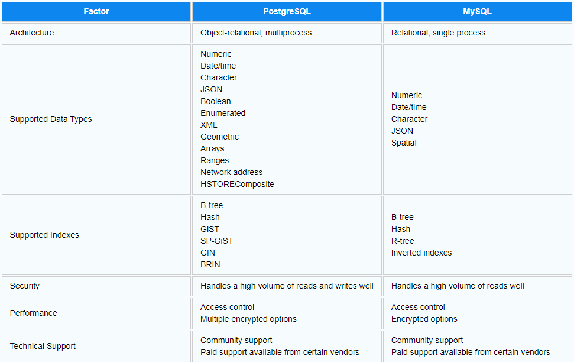

## SQL Fundamentals

### Table of Contents
- [SQL Fundamentals](#sql-fundamentals)
  - [Table of Contents](#table-of-contents)
  - [What is DBMS?](#what-is-dbms)
  - [What is RDBMS?](#what-is-rdbms)
  - [What are different types of relations exist in databases?](#what-are-different-types-of-relations-exist-in-databases)
  - [Difference between Network and Hierarchical database models](#difference-between-network-and-hierarchical-database-models)
  - [What is Query Optimizer?](#what-is-query-optimizer)
  - [Difference between Exclusive \& Shared Lock](#difference-between-exclusive--shared-lock)
  - [What is postgreSQL?](#what-is-postgresql)
  - [What are constrains \& their types?](#what-are-constrains--their-types)
  - [Difference between Delete vs Drop vs Truncate](#difference-between-delete-vs-drop-vs-truncate)
  - [Union vs Union All](#union-vs-union-all)
  - [What are manipulation functions in sql?](#what-are-manipulation-functions-in-sql)
  - [Having vs Where Clause](#having-vs-where-clause)
  - [Differentiate Group By \& Order By](#differentiate-group-by--order-by)
  - [Types of Joins supported in SQL](#types-of-joins-supported-in-sql)
  - [Nested Subquery vs Correlated Subquery](#nested-subquery-vs-correlated-subquery)
  - [Difference between Joins \& Subqueries](#difference-between-joins--subqueries)
  - [Pattern Matching in query](#pattern-matching-in-query)
  - [Output of the query `select * from Employee ORDER BY 'sal' DESC limit 5,1;`](#output-of-the-query-select--from-employee-order-by-sal-desc-limit-51)
  - [How to select 2nd Highest salary using MAX aggregation function in salary column?](#how-to-select-2nd-highest-salary-using-max-aggregation-function-in-salary-column)
  - [Difference between VARCHAR vs VAR](#difference-between-varchar-vs-var)
  - [What is Trigger?](#what-is-trigger)
  - [Difference between Trigger and Stored Procedure](#difference-between-trigger-and-stored-procedure)
  - [Functional vs Transitive Dependency](#functional-vs-transitive-dependency)


### What is DBMS?

Databse Management System is software used to define, create, maintain the database and provides controlled access to the data.

### What is RDBMS?

**R** stands for Relational. RDBMS is used to only store or manage the data that are stored in form of tables.

### What are different types of relations exist in databases?
There are basically three types of relations between two entities:
- **One to One**: A One-to-one relationship means a single record in Table A is related to the single record in Table B and vice-versa.
- **One to Many**: Such a relationship exists when each record of table A can be related to one or more records of another table i.e., table B. However, a single record in table B will have a link to a single record in table A. 
- **Many to Many**: A many-to-many relationship exists between the tables if a single record of the first table is related to one or more records of the second table and a single record in the second table is related to one or more records of the first table. 

### Difference between Network and Hierarchical database models
- **Network Model**: Each parent node has one or many child nodes or vise versa. This model supports all three types of relations mentioned above. (Graph structure)
- **Hierarchical Model**: Each parent node has one or many child nodes but child can have only a single parent node. This model support only one-to-one and one-to-many relations between entities. (Tree structure)


### What is Query Optimizer?

The query optimizer in DBMS attempts to determine the most efficient way to execute a given query by considering the possible query plans.

### Difference between Exclusive & Shared Lock

- **Exclusive Lock**: (For Write) It is created on a data item on which transaction is abput to write.
- **Shared Lock**: (For Reads) It allows more than one transactions to read data items.

### What is postgreSQL?

PostgreSQL is an object-relational database management system (ORDBMS). PostgreSQL is an open-source descendant of this original Berkeley code. It supports a large part of the SQL standard and offers many modern features:
- complex queries
- foreign keys
- triggers
- updatable views
- transactional integrity
- multiversion concurrency control

**What is Primary Key?**

Database should have a column or group of columns which uniquely identify the row of a table.
PK = Unique + Not Null

**What is Foreign Key?**

`Forign Key` is column or group of columns in a table (child), which refers to the `Primary Key` of other table (parent).
When we want to create a relation between two or more tables, we use foreign key. 
It maintance referntial integrity in database. i.e, if primary key row gets deleted in parent table than child table rows which uses the primary key should also gets deleted. 

### What are constrains & their types?

While creating a table there are rules to be defined for each columns to specify types of data supported for the perticular column.
- NOT NULL: Column can not have null value.
- UNIQUE: All the values in a column are different.
- PRIMARY KEY: Combination of NOT NULL & UNIQUE.
- FOREIGN KEY: Prevents actions that would destroy the links between tables.
- CHECK: Ensures that the column value will satisfy the condition.
- DEFAULT: Sets the default value in column is no value provided.

**Different types of SQL commands**

There are 5 types of commands:
- Data Defination Language (**DDL**): Create, Alter, Drop, Truncate, Rename (Table level cmds)
- Data Manupulation Language (**DML**): Select, Insert, Update, Delete (Row level cmds)
- Data Control Language(**DCL**): Grant, Revoke (Access Control on database for a user)
- Transaction Control Language (**TCL**): Commit, Rollback, Savepoint (Query control as a transation)
- **Constants**: PK, FK, Check, Not Null, Unique, Default (data types cmds)

### Difference between Delete vs Drop vs Truncate

- **DELETE**: Deletes one or all rows from a table. Can be rolled back (DML). Slower than Truncate.
- **TRUNCATE**: Deletes all rows from a table. Can **not** be rolled back (DDL). Faster than Delete & Drop.
- **DROP**: Deletes a databse, view or a table and it's rows. Can **not** be rolled back (DDL). Slower than Truncate.

### Union vs Union All

Both combines the results of two or more sql statements.
- **Union**: Duplicate rows are removed. Slower than union all as there is deduplication.
- **Union ALL**: Doesn't remove the duplicate rows. faster then union.

### What are manipulation functions in sql?

There are many functions to modify the column value while executing the query. following are a few:
- **UPPER(name)**: makes the letters capital in query.
- **INITCAP(name)**: makes first letter uppercase and rest letters in lowercase.
- **CONCAT(name, address)**: concat the values into one string value.
- **MOD(rowno, 2)**: Will return 0 for even rows and 1 for odd rows.

### Having vs Where Clause

Having is used in Group By clouse with select statement.
Where clause is applied on each row before they are part of Group By function in a query.

### Differentiate Group By & Order By

- Group By: This clause is used to use aggregation functions on more than one set of rows.
- Order By: This used for sorting the rows based on a column value.

### Types of Joins supported in SQL

```
Orders (OrderID, CustomerID, OrderDate);
Customers (CustomerID, CustomerName, ContactName, Country);
```
- **Cross Join**: Return all the possible combinations of rows from two tables. Also called the cartesion product.
- **Inner Join**: Only returns the matching rows from two tables. Also called a simple join.
- **Left Outer Join / Left Join**: Returns the matching rows from two tables and rows from the left table.
- **Right Outer Join / Right Join**: Returns the matching rows from two tables and rows from the right table.
- **Full Outer Join**: Returns all the rows from two tables.

Eg., Find details of customers who have ordered.
```
SELECT * from Customers JOIN Orders 
ON Orders.CustomerID=Customers.CustomerID;
```

### Nested Subquery vs Correlated Subquery

```
Orders (OrderID, CustomerID, OrderDate);
Customers (CustomerID, CustomerName, ContactName, Country);
```
They are used to do what joins do in a query. but in a different way. They gets executed in a different way.
- **Nested SubQuery**: (Bottom up approach) It's written in nested way. First the child query gets executed and they the results are used to compare for each row of parent query. eg., Find details of customers who have ordered.
    ```
    SELECT * FROM Customers WHERE 
    CustomerID IN (SELECT CustomerID FROM Orders);
    ```  
- **Correlated Subquery**: (Top down approach) It's works by each row of parent query is selected and then compared with the result rows return by the child query. eg., Find details of customers who have ordered.
    ```
    SELECT * FROM Customers where 
    EXISTS (SELECT CustomerID FROM Orders 
    WHERE Orders.CustomerID=Customers.CustomerID);
    ```

### Difference between Joins & Subqueries

- Joins are more optimized by the server so queries are faster. They needs to be carefully written, ineffecient joins can degrade the performace.
- Subqueries are more logical representation so they are easy to read and write. 
- 

### Pattern Matching in query

- `WHERE name LIKE '%a'`: last letter `a`.
- `WHERE name LIKE 'a%'`: 1st letter `a`.
- `WHERE name LIKE '%a%'`: word should contain `a`.
- `WHERE name LIKE '_a%'`: 2nd letter `a`.
- `WHERE name LIKE 'a_%'`: 1st letter `a` and 2nd should be there.
- `WHERE name LIKE 'a%y'`: 1st letter `a` and last letter `y`.

**Important!:** `%ok` is considered a bad query and should be avoided because it ignores the indexes as database does not know starting letter. i.e., it's a full db scan, which is bad if you have millions of rows. There is a work around for this though. i.e., you can add one more column to table which has reverse string as the value and you can do match like `ko%`. Notice that we also reversed the query string.
e.g., if name column value is 'ashok' then name_reverse column value would be 'kohsa'. So for the query `WHERE name_reverse LIKE '%ok'` to match any word ending with 'ok' we can use `WHERE name_reverse LIKE 'ko%'` which will use index on reverse_name to perform faster.

### Output of the query `select * from Employee ORDER BY 'sal' DESC limit 5,1;`

It will return 6th highest.
With mysql, the LIMIT parameters are `offset, row_count`, but the first parameter is optional. So when you have two parameters, the first is the starting row, the second is the number of rows. You asked for LIMIT 5, 1 which means 1 rows, starting from row 5.

### How to select 2nd Highest salary using MAX aggregation function in salary column?

```
SELECT MAX(salary) AS salary FROM employee 
    WHERE salary <> (SELECT MAX(salary) FROM employee)
```

### Difference between VARCHAR vs VAR

The VAR stands for variable length in VARCHAR. To give you an example, CHAR(10) is a fixed-length non-Unicode string of length 10, while VARCHAR(10) is a variable-length non-Unicode string with a maximum length of 10. This means the actual length will depend upon the data.
- **TRADEOFF #1** Obviously, VARCHAR holds the advantage since variable-length data would produce smaller rows and, thus, smaller physical files.
- **TRADEOFF #2** Since CHAR fields require less string manipulation because of fixed field widths, index lookups against CHAR field are on average 20% faster than that of VARCHAR fields. This is not any conjecture on my part. The book MySQL Database Design and Tuning performed something marvelous on a MyISAM table to prove this. The example in the book did something like the following:

### What is Trigger? 

A trigger is a special kind of stored procedure in database which automatically invokes whenever a special event in the database occurs. For example, a trigger can be invoked when a row is inserted into a specified table or when certain table columns are being updated.
e.g., trigger will compute those two values and insert with the entered values. i.e.,
```
create trigger stud_marks 
before INSERT 
on 
Student 
for each row 
set Student.total = Student.subj1 + Student.subj2 + Student.subj3, Student.per = Student.total * 60 / 100;
``` 

### Difference between Trigger and Stored Procedure

- **Composition**: Normally stored procedure are group of SQL commands stored and can be executed manually with `exec` or scheduled. Triggers are not run manually.
- **Input Parameters**: Parameters can be passed to stored procedure but not to triggers.
- **Return Values**: Stored procedure can call another stored procedure but not triggers.
- **Transactions**: Stored procedure can run transactions but not triggers.


**What are ACID Proprties?**

ACID properties are the four key characteristics that define the reliability and consistency of a transaction in a Database Management System (DBMS). The acronym ACID stands for Atomicity, Consistency, Isolation, and Durability. Here is a brief description of each of these properties:
- **Atomicity**: Atomicity ensures that a transaction is treated as a single, indivisible unit of work. Either all the operations within the transaction are completed successfully, or none of them are. If any part of the transaction fails, the entire transaction is rolled back to its original state, ensuring data consistency and integrity.
- **Consistency**: Consistency ensures that a transaction takes the database from one consistent state to another consistent state. The database is in a consistent state both before and after the transaction is executed. Constraints, such as unique keys and foreign keys, must be maintained to ensure data consistency.
- **Isolation**: Isolation ensures that multiple transactions can execute concurrently without interfering with each other. Each transaction must be isolated from other transactions until it is completed. This isolation prevents dirty reads, non-repeatable reads, and phantom reads.
- **Durability**: Durability ensures that once a transaction is committed, its changes are permanent and will survive any subsequent system failures. The transaction’s changes are saved to the database permanently, and even if the system crashes, the changes remain intact and can be recovered.

### Functional vs Transitive Dependency

- **Functional Dependency**: A functional dependency is an association between two attributes of the same relational database table. One of the attributes is called the determinant and the other attribute is called the determined. For each value of the determinant there is associated one and only one value of the determined. e.g., `A = fn(B)`.
- **Transitive Dependency**: Transitive dependency is expressing the dependency of A on C when A depends on B and B depends on C. eg., `A = fn1(B)` and `B = fn2(C)` then we can say `A = fn1(fn2(C))`.


**Comparison of PostgreSQL vs MySQL:**

Here is a comparison table to help you understand the different characteristics of PostgreSQL vs MySQL:

