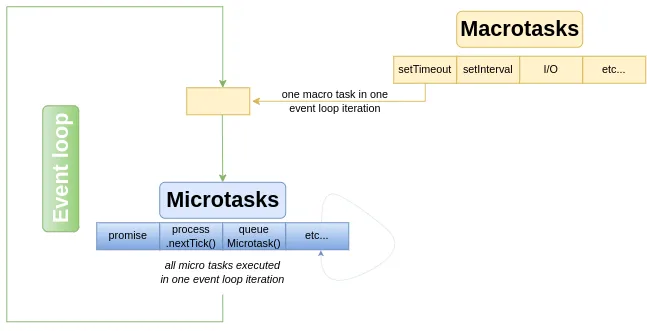

## Javascript fundamentals

### Table of Contents  
- [Javascript fundamentals](#javascript-fundamentals)
  - [Table of Contents](#table-of-contents)
  - [How does Javascript works?](#how-does-javascript-works)
  - [What is event-loop?](#what-is-event-loop)
  - [What is hoisting in js?](#what-is-hoisting-in-js)
  - [Map, WeakMap, Set WeakSet](#map-weakmap-set-weakset)
  - [Call vs Bind vs Apply](#call-vs-bind-vs-apply)
  - [Write a polyfill for bind function](#write-a-polyfill-for-bind-function)
  - [Closure](#closure)
  - [Factory Functions](#factory-functions)
  - [What is `this` keyword?](#what-is-this-keyword)
  - [Differnce between normal function and fat arrow function](#differnce-between-normal-function-and-fat-arrow-function)
  - [Map vs ForEach vs Filter vs Some vs Find vs Reduce](#map-vs-foreach-vs-filter-vs-some-vs-find-vs-reduce)
  - [What is callback hell?](#what-is-callback-hell)
  - [What is Promise?](#what-is-promise)
  - [Promise.all vs Promise.allSettled](#promiseall-vs-promiseallsettled)
  - [Shallow vs Deep copy](#shallow-vs-deep-copy)


### How does Javascript works?

Javascript is interpreted programming language. It is used as scripting which means its runs on client browser like chrome(V8 engine), firefox (Spidermonkey engine) etc. It's also used as server-side language as there is Node which is a runtime environment to run js.
JS is a single threaded and single concurrent programming language which means it can handle one task at a time. And to handle the concurrent/async tasks it uses **event-loop**.

### What is event-loop?

Since Js has single callstack, It can not wait for the async tasks like setTimeOut/Api/IO calls because this would block the execution which will block UI. So for this we have event-loop running in background, which is always checking if there are some callbacks in queues to be proccessed for example say when setTimeout triggers, the event-loop will know about it and put the callback in js callstack (when callstack is empty). This provides a concurrency to Js.
So There are multiple queues which are present for handling different kind of async tasks. macro-task queue for (setTimeout, setInterval, I/O), micro-task queue for (async promises, next-tick). Event-loop keeps checking the queue for the callbacks to be proccessed in cyclic order.



### What is hoisting in js?

Hoisting is the mechanism by which js create a global execution context where the variables and function gets declared before execution starts. js hoist/declare the `var` and function but does not hoist `let` `const` and `arrow functions`. For `let` and `cost`, from the point execution starts to the point where they are declared is called the `temporal dead zone` and we try to access them we get reference error.
`var` is function scopped whereas `let` and `const` are block/lexically scopped. 


### Map, WeakMap, Set WeakSet

Map is used to create a Object in js in which a property can be anthing like a number, function or object unlike normal object whereas WeakMap properties can be only object or function. 
Maps -> Iterables, Does not let garbage collector remove the key, Holds the key
WeakMap -> Not iterable, let garbage collector remove the key and the object, Holds the key as refernce.
Set is used to create a unique list of items. The main difference is that references to objects in Set are strong while references to objects in WeakSet are weak. This means that an object in WeakSet can be garbage collected if there is no other reference to it. side-effects are similar to Map like WeakSet are not iterable, WeakSets are collections of objects only.

### Call vs Bind vs Apply

consider we have an object:
```
let person = {
    name: 'Ashok', 
    show: function(age, height){ 
        return `This is ${this.name} whose age is ${age} and height is ${height} foot`
    }
}
```
**Call**: if we want to use just the function with our paramters, then we would as following
```
let john = {
    name: 'John' 
}
person.show.call(john, 30, 5.9)
output: 'This is John whose age is 30 and height is 5.9 foot'
```
**Apply**: if we want to pass all paramters as array instead of separate args. 
```
let john = {
    name: 'John' 
}
person.show.apply(john, [30, 5.9])
output: 'This is John whose age is 30 and height is 5.9 foot'
```
**Bind**: if we want to get new function which we can invoke later with our parameters
```
let john = {
    name: 'John' 
}
let showFun = person.show.bind(john, 30, 5.9)
showFun()
output: 'This is John whose age is 30 and height is 5.9 foot'
```

### Write a polyfill for bind function

```
Function.prototype.myBind = function(...args){
    let fn = this; // this refers to function
    let params = args.slice(1) // get other params as first is object
    return function (...args1) {
        fn.call(args[0], ...params, ...args1)
    }
}
let showFun = person.show.myBind(john, 30)
showFun(5.9)
```


### Closure

When a child function hold the reference to the parent function's proprties after parent function is executed.
```
let Circle = function (r) {
    const PI = 3.14
    return {
        redius: r,
        area: function (){
            return r * r * PI;
        },
        circumference = function (){
            return 2 * PI * r;
        }
    }
}

let cir1 = Circle(2)
cir1.area()
cir1.circumference()
```
In the above example area and circumference is forming a closure with its parent function.
Its used to create data encapulation, hiding the things from outer scope, avoid naming conflict in scope chain. JQuery uses cloure havily.


### Factory Functions

The Factory Function is similar to constructor functions/class functions, but instead of using new to create an object, factory functions simply creates an object and returns it.
Example: the `Circle` function in above example is a factory function.

### What is `this` keyword?

`this` always refers to the current object in javascript. by default `this` in browser refers to `window` object. in a function it would refer to function object.

### Differnce between normal function and fat arrow function

`function(){}` has its own `this` and gets hoisted but `() => {}` does not have its own `this` but refer to parent object and does not get hoisted.  

### Map vs ForEach vs Filter vs Some vs Find vs Reduce

There are higer order function provided for arrays. `.map` return a new modified array, `.forEach` used to modify existing array, `.Filter` return the new array filtered based on condition, `.some` return true/false if condition is true for any item, `.find` returns the first item which satisfies the condition, `.reduce` return a single value and used for performing accumulation on the object passed as second arg to reduce function.


### What is callback hell?

When have nested callbacks for a callback function, it becomes hard to read and looks messy, its referred as callback hell. To avoid it wee have `async` `await` feature to write callback one after another.

### What is Promise?

The `Promise` object represents the eventual completion (or failure) of an asynchronous operation and its resulting value.A Promise is in one of these states:
- pending: initial state, neither fulfilled nor rejected.
- fulfilled: meaning that the operation was completed successfully.
- rejected: meaning that the operation failed.

### Promise.all vs Promise.allSettled

When we have multiple promises to handle `Promise.all` is used to wait for all to and returns resolved, but if any promise gets rejected then Promise.all returns rejected. But in case of `Promise.allSettled` return array of resolved and rejected promises and let us manually handle the responses. 

### Shallow vs Deep copy
Shallow copy is data is copied only at 1 or 2 level depth but nested object shares the same reference.
```
let data1 = {
    name: 'Ashok',
    skills: {
        node: 'expert',
        react: 'good'
    }
    getName: function(){
        return this.name;
    }
}

let data2 = Object.assign({}, data1)
//OR
data2 = {...data1} //destruction
```
In above example if we modify `data2.skills.node = 'okay'`, it will also modify the `data1.skiils` object.

To create deep copy there are ways in which `JSON.parse(JSON.stringify(data1))` is popular, but it we will loose the types, functions, dates etc. To create a exact deep copy one can use Lodash library function `_.cloneDeep(data1)` or write a function to iterate all nested elements of the data1 and add to new data2.

